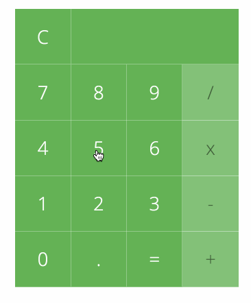

# Calculator

### Project Description:

* #### Create a calculator using html, CSS, and JavaScript
* #### Chain calculations together and maintain order of operations
* #### Add button to calculate the Modulo of 2 numbers
* #### Add a button to calculate the Square Root of a number
* #### Calculator should perform like this mockup:

